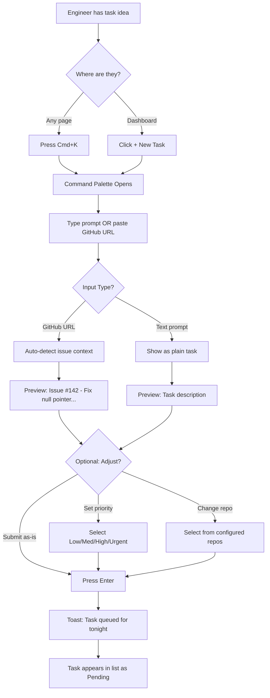
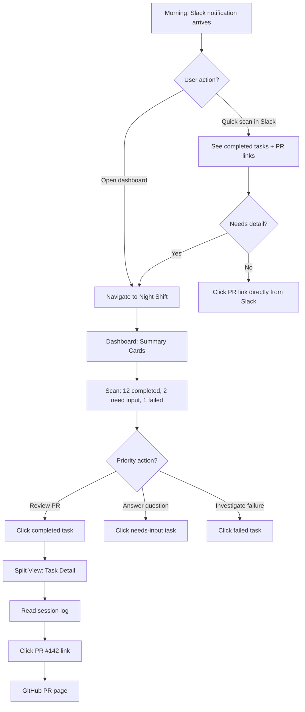
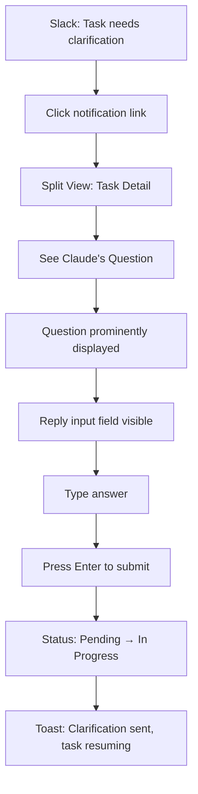
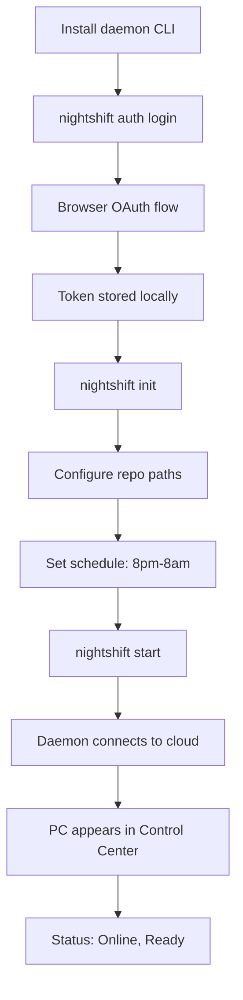

# UX Design Specification: Night Shift

**Author:** Hoalong
**Date:** 2025-12-23

---

## Executive Summary

### Project Vision

Night Shift transforms idle engineer workstations into an overnight AI-powered code factory. By leveraging existing local development environments with massive repos already cloned, teams can submit bug fixes, PR reviews, and plugin development tasks before leaving work and find them completed by morning—all changes safely going through normal PR review.

### Target Users

**Game Engineer (Primary)**
C++ developers on Unreal Engine projects who want to offload repetitive coding tasks to overnight AI execution. They value fire-and-forget simplicity and morning results they can quickly review.

**Tech Lead (Secondary)**
Senior engineers responsible for team productivity who need visibility across all task activity, priority control, and metrics to justify AI automation investments.

### Key Design Challenges

1. **Trust & Transparency** - Making AI work visible and understandable, not a black box
2. **Minimal Friction Task Creation** - Sub-30-second task submission or engineers won't adopt
3. **Self-Triaging Communication** - Seamless clarification flow via Slack integration
4. **Dual-Context Coherence** - Central Control Center and Local Daemon UI must feel unified
5. **Schedule Clarity** - Clear communication of "now" vs "scheduled" states

### Design Opportunities

1. **"Morning Coffee" Dashboard** - Scannable summary of overnight wins and action items
2. **Conversational Task Input** - Natural language task creation with optional structure
3. **Ambient Status Awareness** - Passive local indicators rather than attention-demanding UI
4. **Slack-Native Notifications** - Meet engineers where they live

## Core User Experience

### Defining Experience

Night Shift's core loop is elegantly simple: **drop a task in the evening, wake up to a PR**. The system optimizes for two critical moments—frictionless task creation and satisfying morning review.

The primary user action is task submission, which must feel as quick as sending a message. The secondary action is morning triage—scanning what completed, what needs review, and what needs clarification.

### Platform Strategy

| Surface         | Implementation          | Purpose                                            |
| --------------- | ----------------------- | -------------------------------------------------- |
| Control Center  | Web app (responsive)    | Central task management, team overview             |
| Local Daemon UI | Web browser (localhost) | PC status, local repo config, quick task add       |
| Notifications   | Slack integration       | Real-time pings for completions and clarifications |

No dedicated mobile app required. The web Control Center supports mobile form factors for the "quick task from home" use case.

### Effortless Interactions

**Task Creation (< 10 seconds)**

- Paste a GitHub issue URL → auto-extracts context
- Type a text prompt → submits immediately
- No required fields, no friction, no ceremony

**Morning Review (< 60 seconds)**

- Dashboard shows overnight activity at a glance
- Completed tasks link directly to PRs
- Needs-clarification items are visually distinct
- One-click access to session logs for transparency

### Critical Success Moments

1. **First Task Drop** - User submits in under 10 seconds, thinks "that was easy"
2. **First Morning Win** - User sees completed PR, reviews clean diff, merges
3. **First Clarification** - Slack notification is helpful, user replies, task resumes
4. **First "Wow"** - User realizes tedious work happened while they slept

### Experience Principles

1. **Speed to Submit** - Task creation measured in seconds, not minutes
2. **Trust Through Transparency** - Show what Claude did, not just that it finished
3. **Engineer Aesthetic** - Monospace fonts, code-native design, dark-mode-first
4. **Morning Wins** - Dashboard optimized for 60-second scan
5. **Slack as Nerve Center** - Notifications there; web UI for depth

## Desired Emotional Response

### Primary Emotional Goals

**Core Emotion: Satisfaction**
Night Shift should make engineers feel quietly satisfied—the calm confidence that comes from knowing tedious work happened while they slept. Not flashy productivity theater, but genuine time reclaimed.

**Supporting Emotions:**

- **Confidence** at task submission ("this will work")
- **Peace of mind** overnight ("it's handled")
- **Trust** when reviewing results ("I can see what it did")

### Emotional Journey Mapping

| Stage                 | Target Emotion              | Design Implication                  |
| --------------------- | --------------------------- | ----------------------------------- |
| Task Creation         | Confident + Anticipatory    | Fast submission, clear confirmation |
| Overnight             | Peace of mind               | No need to check; trust the system  |
| Morning Notification  | Satisfaction + Mild delight | The "magic moment"—Slack shows wins |
| PR Review             | Trust + Efficiency          | Transparent logs, clean diffs       |
| Clarification Request | Collaborative               | Helpful tone, easy reply flow       |
| Task Failure          | Understanding               | Clear explanation, easy retry       |

### The Magic Moment

The defining emotional peak is the **morning Slack notification**:

> ✅ 3 tasks completed overnight
> → Fix null pointer in PlayerInventory (#142) - PR ready
> → Add logging to NetworkManager - PR ready
> → Refactor save system error handling - PR ready

This notification—before the engineer even opens their laptop—is the product's emotional signature. Everything else exists to make this moment possible and satisfying.

### Micro-Emotions

| Positive (Cultivate) | Negative (Prevent) |
| -------------------- | ------------------ |
| Confidence           | Anxiety            |
| Trust                | Skepticism         |
| Satisfaction         | Frustration        |
| Collaboration        | Annoyance          |
| Understanding        | Confusion          |
| Efficiency           | Tedium             |

### Emotional Design Principles

1. **Satisfaction Over Spectacle** - No gamification, no streaks, no unnecessary celebration. Quiet wins.
2. **Trust Through Transparency** - Show the work, not just the result. Session logs build confidence.
3. **Notifications as Gifts** - Each Slack ping should feel like good news, not an interruption.
4. **Failure With Dignity** - When things go wrong, explain clearly and offer a path forward.
5. **Morning Momentum** - Design for the 60-second scan that starts the day feeling ahead.

## UX Pattern Analysis & Inspiration

### Inspiring Products Analysis

**Raycast/Alfred**
Command palette launchers that prove single-input interfaces can be incredibly powerful. Engineers love them because typing is faster than clicking, and smart parsing means minimal keystrokes to achieve goals.

**Linear**
Modern issue tracker that proves "enterprise" software can feel fast and beautiful. Dark-mode native, keyboard-driven, with information density that respects user intelligence.

**Common Thread:** Both tools feel fast because they _are_ fast, minimize friction at every step, and trust users to be competent.

### Transferable UX Patterns

**From Raycast/Alfred:**

- Command palette (`Cmd+K`) for quick task creation
- Single input field that parses intent (text prompt vs GitHub URL)
- Instant feedback as user types
- Smart defaults that rarely need overriding
- Keyboard-first, mouse-optional

**From Linear:**

- Information-dense dashboard that doesn't feel cluttered
- Keyboard navigation (`j/k` movement, `Enter` to act)
- Color-coded status chips for at-a-glance scanning
- Dark mode as the native experience
- Smooth 60fps animations that feel premium
- Fast filtering and saved views

### Anti-Patterns to Avoid

| Pattern                   | Problem                            | Our Approach                    |
| ------------------------- | ---------------------------------- | ------------------------------- |
| Modal confirmation chains | Slows users down, implies distrust | Single confirmation maximum     |
| Required form fields      | Creates friction, blocks flow      | Smart defaults, optional fields |
| Mouse-only interactions   | Alienates keyboard users           | Everything has a shortcut       |
| Light mode default        | Not engineer-native                | Dark-first design               |
| Excessive loading states  | Feels slow even when fast          | Optimistic UI updates           |
| Notification spam         | Users tune out                     | Batched, meaningful alerts      |

### Design Inspiration Strategy

**Adopt:** Command palette pattern, keyboard navigation, dark-first, status chips
**Adapt:** Linear's sidebar (simplified for Night Shift's PC/Repo/Activity model)
**Avoid:** Form-heavy task creation, mouse-required flows, light-mode-first thinking

## Design System Foundation

### Design System Choice

**Framework:** shadcn/ui + Tailwind CSS
**Rationale:** Provides copy-paste component ownership, dark-mode native design, and the minimal chrome aesthetic aligned with Linear/Raycast inspiration. React-based, built on accessible Radix primitives.

### Rationale for Selection

1. **Aesthetic Alignment** - shadcn/ui's default style matches the minimal, dark-first, engineer-focused aesthetic we defined
2. **Component Ownership** - Copy-paste model means no library lock-in, full customization control
3. **Speed + Quality** - Pre-built components for command palette, tables, badges accelerate development
4. **Tailwind Integration** - Rapid iteration with consistent design tokens
5. **Accessibility Built-in** - Radix primitives ensure keyboard navigation and screen reader support

### Implementation Approach

**Core shadcn/ui Components:**

- `Command` - Task creation palette (Cmd+K)
- `Table` - Task list, PC list views
- `Badge` - Status indicators (pending, completed, failed, needs_human)
- `Dialog` - Task details, session log viewer
- `Card` - Dashboard summary widgets
- `Toast` - Non-blocking confirmations
- `Input` - Task prompt input, search

**Custom Components Required:**

- Session log viewer (terminal-aesthetic output display)
- PC status indicator (online/offline/scheduled states)
- GitHub issue preview card
- Task timeline/progress visualization

## Defining Core Experience

### The Defining Experience

**"Drop a task, wake up to a PR"**

Night Shift's defining experience is the complete overnight loop: frictionless task submission in the evening followed by satisfying result discovery in the morning. Users will describe this to coworkers as "I just type what I need, and it's done when I get to work."

### User Mental Model

Engineers approach Night Shift with familiar mental models:

- **CI/CD Pipeline** - Submit work, it runs in background, check results later
- **GitHub Issues** - Reference issues, get PRs back
- **Slack Bots** - Quick commands yield async results

The overnight timing is the novel element, but it maps to "scheduled jobs" which engineers understand intuitively.

### Success Criteria

**Task Creation Success:**

- Submission completes in under 10 seconds
- Zero required fields (smart defaults handle everything)
- User feels confident the task is queued
- Can immediately add another task or leave

**Morning Review Success:**

- Slack notification arrives before user opens laptop
- Dashboard scan takes under 60 seconds
- Completed PRs are one click away
- Clarification requests are clearly actionable
- User starts day feeling ahead, not behind

### Novel UX Patterns

| Pattern              | Type          | Implementation                                      |
| -------------------- | ------------- | --------------------------------------------------- |
| Command Palette      | Established   | `Cmd+K` opens task creation                         |
| GitHub URL Detection | Established   | Auto-parse and extract context                      |
| Task Queue           | Established   | CI/CD-style job list                                |
| Overnight Execution  | Novel Framing | Clear schedule indicators                           |
| Self-Triaging AI     | Novel         | Explicit "needs_human" status with question display |

### Experience Mechanics

**Task Creation Flow:**

1. `Cmd+K` → Command palette appears instantly
2. Type prompt or paste GitHub URL
3. System auto-detects intent, shows preview
4. `Enter` to submit → Toast confirms → Done

**Morning Review Flow:**

1. Slack notification arrives (magic moment)
2. Click through to dashboard OR review summary in Slack
3. Scan overnight activity (green/yellow/red status)
4. Click PR links for completed work
5. Answer clarification questions if needed
6. 60 seconds total, day starts with wins

## Visual Design Foundation

### Color System

**Primary Palette (Dark Mode):**
| Token | HSL Value | Hex | Usage |
|-------|-----------|-----|-------|
| Background | `hsl(0 0% 3.9%)` | `#0A0A0A` | Page background |
| Surface | `hsl(0 0% 7%)` | `#121212` | Cards, elevated elements |
| Border | `hsl(0 0% 14.9%)` | `#262626` | Subtle dividers |
| Text Primary | `hsl(0 0% 98%)` | `#FAFAFA` | Main content |
| Text Muted | `hsl(0 0% 63.9%)` | `#A3A3A3` | Secondary content |
| Accent | `hsl(24 95% 53%)` | `#F97316` | Actions, links, focus |
| Accent Hover | `hsl(24 95% 45%)` | `#EA580C` | Hover states |
| Success | `hsl(142 76% 36%)` | `#22C55E` | Completed tasks |
| Warning | `hsl(38 92% 50%)` | `#F59E0B` | Needs attention |
| Destructive | `hsl(0 84% 60%)` | `#EF4444` | Errors, failures |

**Color Rationale:**

- Orange accent conveys energy and action—fitting for a tool that works while you sleep
- High contrast dark mode reduces eye strain for engineers
- Status colors (green/amber/red) are intuitive and color-blind accessible

### Typography System

**Font Family:** JetBrains Mono (monospace throughout)

Using monospace as the primary UI font reinforces the engineer-native aesthetic. Every element feels like it belongs in a terminal or IDE—because it does.

**Type Scale:**
| Level | Size | Weight | Usage |
|-------|------|--------|-------|
| h1 | 1.75rem (28px) | 600 | Page titles |
| h2 | 1.25rem (20px) | 600 | Section headers |
| h3 | 1.125rem (18px) | 500 | Card headers |
| body | 0.875rem (14px) | 400 | Default text |
| small | 0.75rem (12px) | 400 | Secondary, metadata |
| code | 0.875rem (14px) | 400 | Inline code, logs |

**Line Heights:**

- Headings: 1.2
- Body: 1.5
- Code blocks: 1.6

### Spacing & Layout Foundation

**Base Unit:** 4px (Tailwind default)

**Spacing Scale:**
| Token | Value | Usage |
|-------|-------|-------|
| xs | 4px | Tight inline spacing |
| sm | 8px | Related elements |
| md | 16px | Standard gaps |
| lg | 24px | Section spacing |
| xl | 32px | Major sections |
| 2xl | 48px | Page-level spacing |

**Layout Principles:**

1. **Dense but not cramped** - Information-rich screens with breathing room
2. **Consistent rhythm** - 8px as primary spacing unit
3. **Minimal chrome** - Let content be the interface
4. **Full-width efficiency** - Use horizontal space, avoid narrow columns

**Grid System:**

- Sidebar: Fixed 240px (collapsible)
- Content: Fluid, max-width 1200px for readability
- Tables: Full-width within content area

### Accessibility Considerations

**Contrast Compliance:**

- Text on background: 15.8:1 (exceeds WCAG AAA)
- Muted text on background: 7.2:1 (exceeds WCAG AA)
- Orange accent on background: 4.6:1 (meets WCAG AA)

**Interaction Accessibility:**

- Focus rings: 2px orange outline on all interactive elements
- Keyboard navigation: Full support via Radix primitives
- Screen readers: Semantic HTML, ARIA labels where needed

**Motion:**

- Respect `prefers-reduced-motion` media query
- All animations optional, never required for understanding
- Default: subtle 150ms transitions

## Design Direction Decision

### Design Directions Explored

Six layout directions were explored through interactive HTML mockups (`ux-design-directions.html`):

1. **Dashboard** - Sidebar navigation, summary cards, data tables
2. **Minimal** - Linear-inspired narrow list with status dots
3. **Cards** - Grid layout with task preview cards
4. **Split** - List + detail panel for session log review
5. **Command** - Hero input field, Raycast-inspired task creation
6. **PC-Centric** - Machine-focused view for distributed teams

### Chosen Direction

**Hybrid: Command + Dashboard + Split**

A combined approach that uses different layouts for different user contexts:

| Context          | Layout        | Rationale                                                     |
| ---------------- | ------------- | ------------------------------------------------------------- |
| Task Creation    | Command-First | Raycast-inspired `Cmd+K` palette for sub-10-second task drops |
| Morning Overview | Dashboard     | Summary cards + task table for 60-second morning scan         |
| Task Detail      | Split View    | List + detail panel for reviewing session logs and PRs        |

### Design Rationale

1. **Command Palette for Speed** - Task creation is the most frequent action; it deserves a dedicated, frictionless interface that appears instantly via keyboard shortcut
2. **Dashboard for Overview** - Morning users need a scannable summary of overnight activity; cards provide at-a-glance metrics
3. **Split View for Depth** - When reviewing what Claude did, users need to see session logs; the split view keeps context while showing detail

### Implementation Approach

**Page Structure:**

- `/dashboard` - Morning landing with summary cards and recent tasks table
- `/tasks` - Split view with task list and detail panel
- `/tasks/[id]` - Direct link to specific task detail
- `/pcs` - PC management (Dashboard-style)

**Global Components:**

- Command Palette - Accessible via `Cmd+K` from any page
- Toast notifications - Task creation confirmation
- Keyboard navigation - `j/k` for list navigation, `Enter` to select

**Navigation Flow:**

```
Morning: Dashboard (overview) → Click task → Split View (detail)
Evening: Any page → Cmd+K → Command Palette → Submit task
```

## User Journey Flows

### Task Creation Journey (Evening)

**Trigger:** Engineer has work to offload before leaving
**Goal:** Submit task in under 10 seconds
**Success:** Toast confirms task queued



**Design Decisions:**

- `Cmd+K` accessible from anywhere—no navigation required
- GitHub URL auto-detection reduces typing
- Smart defaults: repo auto-detected from URL, priority = medium
- Single `Enter` to submit—no confirmation modal

### Morning Review Journey

**Trigger:** Slack notification arrives
**Goal:** Scan overnight results in under 60 seconds
**Success:** PR links clicked, day starts with wins



**Design Decisions:**

- Slack notification is first touchpoint—can act without opening app
- Dashboard shows summary cards for at-a-glance status
- Split view keeps task list context while showing detail
- PR links are always one click away

### Clarification Response Journey

**Trigger:** Slack notification for "needs_human" task
**Goal:** Answer Claude's question quickly
**Success:** Task resumes execution



**Design Decisions:**

- Slack notification deep-links to specific task
- Question displayed prominently in task detail
- Reply is inline—no modal or separate page
- Immediate feedback when clarification submitted

### PC Setup Journey (First-Time)

**Trigger:** New engineer wants to use Night Shift
**Goal:** Register PC and configure repos
**Success:** PC shows "online" in Control Center



**Design Decisions:**

- CLI-first setup (engineers prefer terminal)
- OAuth for secure, familiar authentication
- Interactive configuration with sensible defaults
- Local web UI at localhost:9999 for status monitoring

### Journey Patterns

| Pattern                | Usage          | Implementation                              |
| ---------------------- | -------------- | ------------------------------------------- |
| **Cmd+K Anywhere**     | Task creation  | Global keyboard listener, works on any page |
| **Slack as Entry**     | Notifications  | Deep links to specific tasks with context   |
| **Split View Detail**  | Review flows   | List persists while detail panel updates    |
| **Inline Reply**       | Clarifications | No modal, input appears in task context     |
| **Toast Confirmation** | All actions    | 3-second auto-dismiss, non-blocking         |
| **Status Badges**      | All lists      | Color-coded dot + text label                |

### Flow Optimization Principles

1. **Minimize Clicks to Value** - Every journey reaches success state with minimum interactions
2. **Smart Defaults** - Reduce decisions by inferring intent (repo from URL, priority from issue labels)
3. **Progressive Disclosure** - Show optional controls only when needed
4. **Immediate Feedback** - Every action has visible response within 100ms
5. **Error Recovery** - Every failure state has a clear "try again" path

## Component Strategy

### Design System Components (shadcn/ui)

**Available and ready to use:**

| Component    | Night Shift Usage                                           |
| ------------ | ----------------------------------------------------------- |
| `Command`    | Base for task creation palette                              |
| `Table`      | Task lists, PC lists                                        |
| `Badge`      | Status indicators (pending, completed, failed, needs_human) |
| `Dialog`     | Task detail modal, settings                                 |
| `Card`       | Dashboard summary cards                                     |
| `Toast`      | Action confirmations                                        |
| `Input`      | Prompt input, search, reply fields                          |
| `Button`     | Actions                                                     |
| `Tabs`       | View switching                                              |
| `ScrollArea` | Session log scrolling                                       |
| `Separator`  | Visual dividers                                             |
| `Tooltip`    | Keyboard shortcut hints                                     |

### Custom Components

#### SessionLogViewer

**Purpose:** Display Claude's execution log in a terminal-like format

**Anatomy:**

```
┌──────────────────────────────────────────┐
│ Session Log                    [Expand]  │
├──────────────────────────────────────────┤
│ 00:01  Analyzing GitHub issue #142...    │
│ 00:03  Read PlayerInventory.cpp          │ ← tool (orange)
│ 00:05  Found null check missing          │
│ 00:08  Edit PlayerInventory.cpp:142      │ ← tool (orange)
│ 00:45  ✓ All tests passed                │ ← success (green)
│ 00:47  Created PR #142                   │ ← tool (orange)
└──────────────────────────────────────────┘
```

**States:** Default, Loading, Empty, Error
**Styling:** JetBrains Mono, timestamps muted, tool calls in orange, success in green

#### PCStatusIndicator

**Purpose:** Show PC connection status at a glance

**States:**
| State | Indicator | Display |
|-------|-----------|---------|
| Online | Green dot | "Ready" |
| Working | Orange pulsing dot | "Working: [task name]" |
| Scheduled | Gray dot | "Scheduled 8pm-8am" |
| Offline | Gray dot | "Offline since [time]" |

**Usage:** PC list sidebar, PC detail header

#### TaskCard

**Purpose:** Compact task display for lists

**Anatomy:**

```
┌────────────────────────────────────────────┐
│ ● Fix null pointer in PlayerInventory     │
│   unreal-game • 2h ago            PR #142 │
└────────────────────────────────────────────┘
```

**States:** Default, Hover, Selected (orange left border), Loading
**Variants:** Compact (split view list), Expanded (card grid)

#### GitHubIssuePreview

**Purpose:** Show unfurled GitHub issue context when URL detected

**Anatomy:**

```
┌──────────────────────────────────────────┐
│ github.com/team/unreal-game              │
│ Issue #142: Fix null pointer exception   │
│ Opened 2d ago by @john                   │
│ Labels: bug, priority-high               │
└──────────────────────────────────────────┘
```

**Usage:** Command palette preview, task detail

#### ClarificationBanner

**Purpose:** Prominently display Claude's question when task needs human input

**Anatomy:**

```
┌──────────────────────────────────────────┐
│ ❓ Claude needs your input               │
│                                          │
│ "Should I use RPCs or replicated         │
│  properties for the player state sync?"  │
│                                          │
│ [Reply input field                     ] │
│                              [Submit →]  │
└──────────────────────────────────────────┘
```

**Styling:** Warning background tint (amber), prominent positioning at top of detail panel

#### SummaryStatCard

**Purpose:** Dashboard metric display

**Variants:**
| Type | Color | Example |
|------|-------|---------|
| Success | Green | Completed: 12 |
| Warning | Amber | Needs Input: 2 |
| Error | Red | Failed: 1 |
| Neutral | White | In Progress: 3 |

### Component Implementation Strategy

**Build Order (by journey criticality):**

| Phase       | Components                            | Enables Journey                       |
| ----------- | ------------------------------------- | ------------------------------------- |
| **Phase 1** | TaskCard, SummaryStatCard             | Dashboard, morning review             |
| **Phase 2** | SessionLogViewer, ClarificationBanner | Task detail, clarification flow       |
| **Phase 3** | PCStatusIndicator, GitHubIssuePreview | PC management, enhanced task creation |

**Implementation Principles:**

1. Build on shadcn/ui primitives and tokens
2. JetBrains Mono for all text content
3. Orange accent (#F97316) for interactive elements
4. Keyboard navigation tested first
5. All components respect dark mode

## UX Consistency Patterns

### Keyboard Patterns

**Global Shortcuts:**
| Key | Action | Context |
|-----|--------|---------|
| `Cmd+K` | Open command palette | Anywhere |
| `Esc` | Close modal/palette | Any overlay |
| `/` | Focus search | Lists, dashboard |
| `?` | Show keyboard shortcuts | Anywhere |

**List Navigation:**
| Key | Action |
|-----|--------|
| `j` / `↓` | Move down |
| `k` / `↑` | Move up |
| `Enter` | Select/open |
| `Esc` | Deselect |

**Task Detail Shortcuts:**
| Key | Action |
|-----|--------|
| `r` | Retry failed task |
| `c` | Focus clarification input |
| `p` | Open PR link |
| `l` | Expand session log |

### Feedback Patterns

**Toast Notifications:**
| Type | Color | Duration | Example |
|------|-------|----------|---------|
| Success | Green | 3s auto-dismiss | "Task queued for tonight" |
| Error | Red | Sticky until dismissed | "Failed to connect" |
| Info | Neutral | 3s auto-dismiss | "Copied to clipboard" |
| Warning | Amber | 5s | "PC offline" |

**Inline Feedback:**

- Form validation: Red border + error message below input
- Success states: Green checkmark icon
- Loading: Subtle pulse animation (not spinner)

### Status Indicator Patterns

**Task Status:**
| Status | Badge Color | Icon | Action Available |
|--------|-------------|------|------------------|
| Pending | Orange | ● | Cancel |
| In Progress | Orange (pulse) | ● | Cancel |
| Completed | Green | ✓ | View PR |
| Needs Human | Amber | ? | Reply |
| Failed | Red | ✕ | Retry |

**PC Status:**
| Status | Dot Color | Animation |
|--------|-----------|-----------|
| Online | Green | None |
| Working | Orange | Pulse |
| Scheduled | Gray | None |
| Offline | Gray | None |

### Empty & Loading States

**Empty States:**
| Context | Message | Action |
|---------|---------|--------|
| No tasks | "No tasks yet" | "Press Cmd+K to create one" |
| No PCs | "No PCs registered" | Link to setup docs |
| No results | "No matching tasks" | "Clear filters" button |

**Loading States:**

- Initial load: Skeleton placeholders (not spinners)
- Action pending: Button shows subtle pulse
- Background refresh: No visible indicator (optimistic UI)

### Button Hierarchy

**Primary Actions (Orange fill):**

- Create task
- Submit clarification
- Retry failed task

**Secondary Actions (Ghost/outline):**

- Cancel
- View details
- Configure settings

**Destructive Actions (Red, requires confirmation):**

- Delete task
- Remove PC

**Button Sizes:**
| Size | Height | Usage |
|------|--------|-------|
| sm | 32px | Inline, compact |
| md | 40px | Default |
| lg | 48px | Hero actions |

### Navigation Patterns

**Sidebar (Control Center):**

- Fixed 240px width, collapsible on mobile
- Sections: Navigation, Repos, PCs
- Active state: Orange text + background tint

**Breadcrumbs:**

```
Dashboard > Tasks > Fix null pointer in PlayerInventory
```

**Command Palette:**

- Centered overlay, 560px wide
- Type to filter, recent items shown by default
- `↑↓` to navigate, `Enter` to select, `Esc` to close

## Responsive Design & Accessibility

### Responsive Strategy

**Desktop (Primary - 1024px+):**

- Full sidebar navigation (240px fixed)
- Split view layouts (list + detail side-by-side)
- Command palette via `Cmd+K`
- Full keyboard shortcut support
- Information-dense tables and lists

**Tablet (768px - 1023px):**

- Collapsible sidebar (hamburger menu)
- Full-width task list, detail as slide-over panel
- Touch-optimized targets (44px minimum)
- Command palette still available

**Mobile (< 768px):**

- Bottom navigation bar
- Stacked layouts (list OR detail, not split)
- Large touch targets throughout
- Simplified command palette
- Focus on core flows: task creation + morning review

### Breakpoint Strategy

| Breakpoint | Width           | Layout Behavior                          |
| ---------- | --------------- | ---------------------------------------- |
| `sm`       | < 640px         | Single column, bottom nav, stacked views |
| `md`       | 640px - 767px   | Single column, larger touch targets      |
| `lg`       | 768px - 1023px  | Collapsible sidebar, overlay details     |
| `xl`       | 1024px - 1279px | Full sidebar, split views                |
| `2xl`      | 1280px+         | Full layout, maximum information density |

**Approach:** Desktop-first design with responsive degradation to simpler layouts on smaller screens.

### Accessibility Strategy

**Target Compliance:** WCAG 2.1 Level AA

**Rationale:** Industry standard for professional tools, ensures keyboard navigation (critical for engineers), good contrast for dark mode, screen reader compatibility.

**Built-in Accessibility (via shadcn/ui + our design):**

- High contrast dark mode (15.8:1 text-to-background ratio)
- Keyboard navigation via Radix primitives
- Visible focus rings (2px orange outline)
- Semantic HTML structure

**Additional Requirements:**

| Requirement      | Implementation                                    |
| ---------------- | ------------------------------------------------- |
| Skip links       | "Skip to main content" link at top of all pages   |
| ARIA labels      | All interactive elements have descriptive labels  |
| Focus management | Focus trapped in modals, restored on close        |
| Reduced motion   | Respect `prefers-reduced-motion` media query      |
| Live regions     | Status updates announced via `aria-live="polite"` |

### Testing Strategy

**Responsive Testing:**

- Chrome DevTools device simulation
- Real device testing: iPhone (Safari), Android (Chrome), iPad
- Cross-browser: Chrome, Firefox, Safari, Edge

**Accessibility Testing:**

- Automated: axe-core integrated in CI pipeline
- Manual: Keyboard-only navigation walkthrough
- Screen readers: VoiceOver (macOS), NVDA (Windows)
- Color blindness: Sim Daltonism or similar simulation

**Pre-Release Checklist:**

- [ ] All pages fully keyboard-navigable
- [ ] All images have meaningful alt text
- [ ] All form inputs have associated labels
- [ ] Color contrast meets AA standards
- [ ] Focus order follows logical reading order
- [ ] Modals trap and restore focus correctly
- [ ] No content conveyed by color alone

### Implementation Guidelines

**Responsive Development:**

- Use Tailwind responsive prefixes (`sm:`, `md:`, `lg:`, `xl:`)
- Desktop-first: Define full layout, then simplify at smaller breakpoints
- Test touch targets on actual devices (not just simulation)
- Optimize images with `srcset` for different screen densities

**Accessibility Development:**

- Use semantic HTML elements (`<nav>`, `<main>`, `<article>`, `<button>`)
- Include `aria-label` on icon-only buttons
- Use `aria-live` regions for dynamic status updates
- Ensure all custom components extend Radix primitives for built-in a11y
